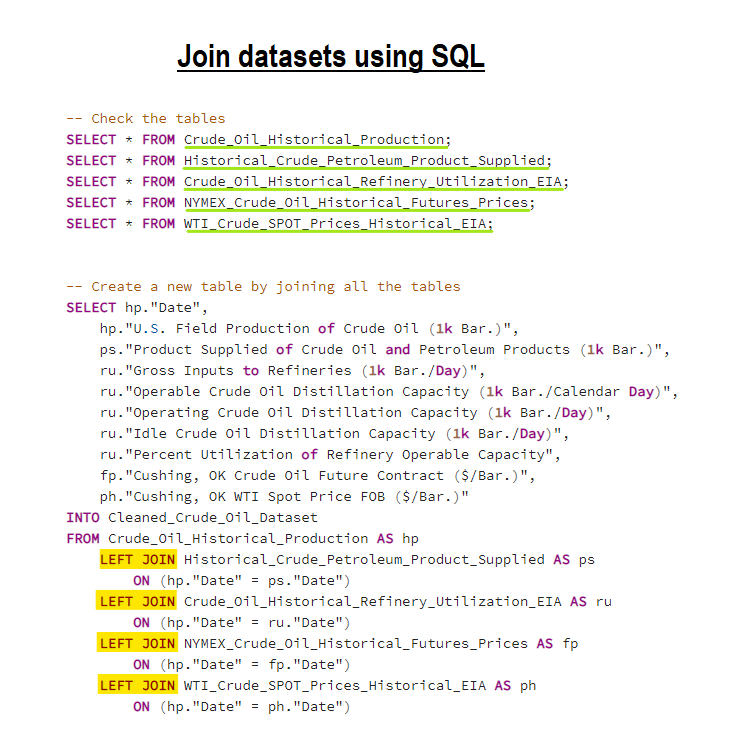
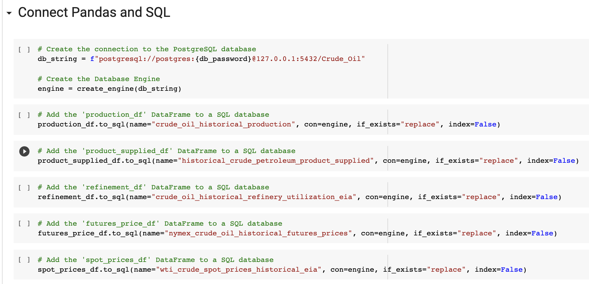
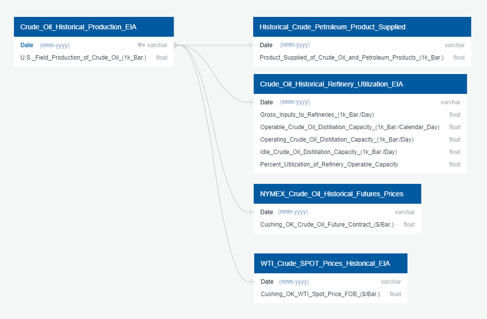
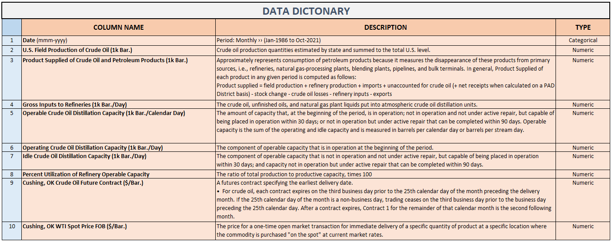
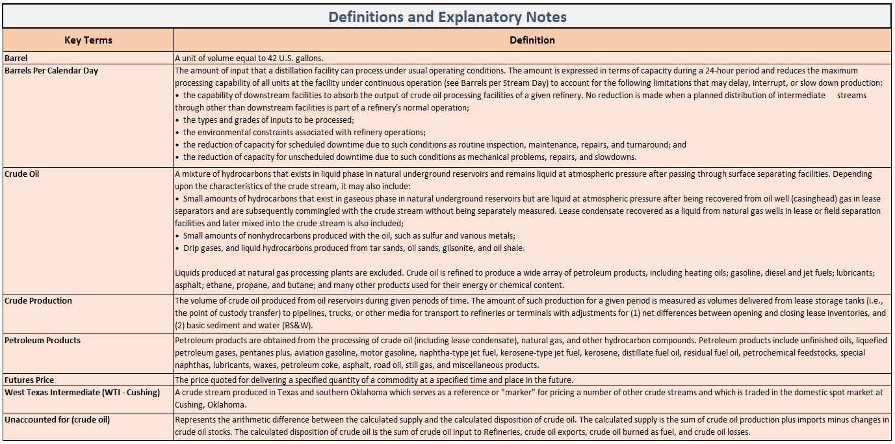

# Crude Oil Price Projection
### GWU Data Analytics Boot Camp

   

### Our Team:

[Siyada Harker](https://github.com/SYDsCorner), 

[Stephan Weir](https://github.com/SteveWeir),

[Tsaschiker Ulziibadrakh](https://github.com/Tesa-U)

### Roles:

- **Data Source Research, Data Cleaning, and Database Storage**
   - **Siyada** (Cleaning & Storage)
   - **Stephan** (Data Source Research)

- **Machine Learning**
   - **Stephan**
      - Linear Regression algorithm
      - Prophet
      - 
   - **Siyada** 
      - [Random Forest Regressor algorithm](https://github.com/SYDsCorner/Crude_Oil_Price_Projection/blob/Siyada_Harker/Machine%20Learning/Random_Forest.ipynb)

- **Dashboard**
   - **Tesa** (Tableau)
   - **Siyada** (HTML/CSS, GitHub Pages)

- **GitHub Repository & Slides**
   - **Tesa** 
   - **Siyada**
   - **Stephan**

  

 

### Software:
- **Data Cleaning** 
   - Jupyter Notebook 6.4.6
      - Python (ETL process)
         - Pandas library
   - [Quick DBD](https://www.quickdatabasediagrams.com/) (Create ERDs)
   - PostgreSQL (Join/Merge datasets)

- **Database Storage**
   - pgAdmin 4
      - PostgreSQL
   - [Google Cloud Platform](https://cloud.google.com/) (GCP)

- **Machine Learning**
   - [Google Colaboratory](https://colab.research.google.com/notebooks/welcome.ipynb) (Google Colab Notebook)
      - Python
         - Scikit-learn library
            - Linear Regression algorithm
            - Random Forest Regressor algorithm

- **Dashboard**
   - Tableau Public 2021.3.3
   - Visual Studio Code 1.63.2
      - HTML/CSS
   - GitHub Pages
   
- **Slides**
   - Google Slides
   

  

 

## Business Case

Many industries, including shipping companies, oil producers, commodities traders, and banks rely heavily upon projections of oil prices to support their decision-making in today’s economy. However, with oil price volatility reaching all-time highs in the past ten years, and with the waning influence of OPEC on the world’s oil production, the task of generating consistent, accurate projections has become increasingly difficult. This has created a considerable opportunity for data scientists and machine learning engineers to apply their skillsets, as well as a demand for complex decision-support systems that firms can employ to navigate the unprecedented dynamics in today’s oil market.

## Project Proposal 

For this project, we intend to develop a robust machine learning model that will deliver a one-year projection for the price of West Texas Intermediate (WTI) Crude Oil, one of the most well-known and widely produced blends of crude in the United States. To do so, we will be examining historical and current data from the Energy Information Agency (EIA), a federal agency that tracks production, sales, and spot & futures prices of WTI Crude. The price projection will be a function of oil production, refinery utilization and capacity, and sales. 

  

 

### Resources:
- Gathering data from [**U.S. Energy Information Administration (EIA)**](https://www.eia.gov/)
   - [**Crude Oil Production**](https://www.eia.gov/dnav/pet/pet_crd_crpdn_adc_mbbl_m.htm) dataset
      > The volume of crude oil produced from oil reservoirs during given periods of time. The amount of such production for a given period is measured as volumes delivered from
        lease storage tanks (i.e., the point of custody transfer) to pipelines, trucks, or other media for transport to refineries or terminals with adjustments for (1) net  
        differences between opening and closing lease inventories, and (2) basic sediment and water (BS&W).
     
   - [**Product Supplied**](https://www.eia.gov/dnav/pet/pet_cons_psup_dc_nus_mbbl_m.htm) dataset
      > Approximately represents consumption of petroleum products because it measures the disappearance of these products from primary sources, i.e., refineries, natural 
        gas-processing plants, blending plants, pipelines, and bulk terminals. In general, Product Supplied of each product in any given period is computed as follows:
        Product supplied = field production + refinery production + imports + unaccounted for crude oil (+ net receipts when calculated on a PAD District basis) - stock change -
        crude oil losses - refinery inputs - exports

   - [**Refinery Utilization and Capacity**](https://www.eia.gov/dnav/pet/pet_pnp_unc_dcu_nus_m.htm) dataset
      > Ratio of the total amount of crude oil, unfinished oils, and natural gas plant liquids run through crude oil distillation units to the operable capacity of these units.

   - [**NYMEX Futures Prices**](https://www.eia.gov/dnav/pet/pet_pri_fut_s1_d.htm) dataset
      > New York Mercantile Exchange, The price quoted for delivering a specified quantity of a commodity at a specified time and place in the future.

   - [**WTI Crude SPOT Prices Historical**](https://www.eia.gov/dnav/pet/pet_pri_spt_s1_d.htm) dataset
      > West Texas Intermediate, The price for a one-time open market transaction for immediate delivery of a specific quantity of product at a specific location where the
        commodity is purchased "on the spot" at current market rates.

  

 

## ETL Process (Extract, Transform, Load)
### 1. Extract : 
- There are 5 datasets stored as CSV files
   - **Crude Oil Production**
      - Area: U.S.
      - Period-Unit: Monthly-Thousand Barrels
      - Date: Jan-1920 to Oct-2021
   - **Product Supplied**
      - Area: U.S.
      - Period-Unit: Monthly-Thousand Barrels
      - Date: Jan-1936 to Oct-2021
   - **Refinery Utilization and Capacity**
      - Area: U.S.
      - Period: Monthly
      - Date: Jan-1985 to Oct-2021
   - **NYMEX Futures Prices**
      - Area: U.S.
      - Period: Daily
      - Date: Mar 30, 1983 to Jan 11, 2022
   - **WTI Crude SPOT Prices Historical**
      - Area: U.S.
      - Period: Daily
      - Date: 1/10/2022 to 1/2/1986

### 2. Transform : 
- Create a DataFrame with the columns that we want to keep or Drop unnecessary columns
- Rename the columns by assigning a list of new column names
- Drop the null values using `dropna()` method
- Convert Data types on "Date" column using `to_datetime` method
- Sort ascending order on "Date" column in the _WTI Crude SPOT Prices Historical_ DataFrame using `sort_values` method
- Filter on "Date" column of all DataFrames between _(1986-01-01 & 2021-10-31)_
- Calculate the average for each month and year in the _NYMEX Futures Prices_ and _the WTI Crude SPOT Prices Historical_ DataFrames
- Round to specific decimals places 
- Convert the "Date" column to datetime _(in abbreviated Month-Year or mmm-yyyy format)_ using `strftime("%b-%Y")` method
- Join/Merge datasets using ***PostgreSQL***
    

### 3. Load :
- Connect Pandas and SQL: using Pandas `to_sql` method paired with ***sqlAlchemy***
   

  

 

## SQL Database

### Database Schema ERD

### Data Dictionary

### Definitions and Explanatory Notes

  

## Machine Learning

- 
- 
- 

## 

  

 

## Dashboard

- Our Tableau Dashboard has four pages where each dispays detailed visualization of WTI Crude Oil Field Production, Product Supplied of Crude Oil, Petrolium Products, and Future Price analysis.

Here is the sneak peak of the Dashboard: 

Here is the link to complete Dashboard: 
> [Link to Tableau Dashboards](https://public.tableau.com/app/profile/tesa3667/viz/CrudeOilPricePrediction/HomeDashboard)

> [Link to GitHub Pages](https://sydscorner.github.io/Crude_Oil_Price_Projection/Templates/index.html)

- 
- 
- 

## Google Slides

> [Link to Google Slides](https://docs.google.com/presentation/d/1lXZA4CR_A27Tfosn4hWl1wO1cqKca4x_WgnOeGEY38w/edit?usp=sharing)

  

 

## Results

- 
- 

  

 

## Summary

- 
- 

### Recommendation for future analysis

- 
- 

### Anything the team would have done differently

- 
- 

  

 

