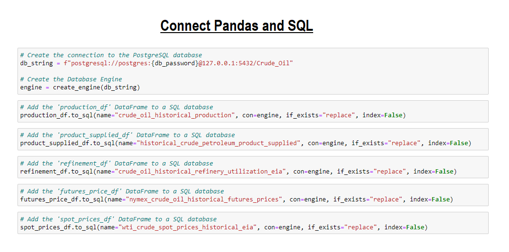

# Crude Oil Price Projection
### GWU Data Analytics Boot Camp

   

## Resources
- Software:
   - Jupyter Notebook 6.4.6
      - Python 
   - pgAdmin 4
      - PostgreSQL 
   - [Quick DBD](https://www.quickdatabasediagrams.com/) 
   - [Google Colaboratory](https://colab.research.google.com/notebooks/welcome.ipynb) (Google Colab Notebook)
   - Tableau Public 2021.3.3
   - Visual Studio Code 1.63.2
   - HTML/CSS
   - GitHub Pages
   
- Data sources:
   - [U.S. Energy Information Administration (EIA)](https://www.eia.gov/)
      - [Crude Oil Production](https://www.eia.gov/dnav/pet/pet_crd_crpdn_adc_mbbl_m.htm)
      - [Product Supplied](https://www.eia.gov/dnav/pet/pet_cons_psup_dc_nus_mbbl_m.htm)
      - [Refinery Utilization and Capacity](https://www.eia.gov/dnav/pet/pet_pnp_unc_dcu_nus_m.htm)
      - [NYMEX Futures Prices](https://www.eia.gov/dnav/pet/pet_pri_fut_s1_d.htm)
      - [WTI Crude SPOT Prices Historical](https://www.eia.gov/dnav/pet/pet_pri_spt_s1_d.htm)

## ETL Process (Extract, Transform, Load)
### 1. Extract : 
- There are 5 datasets stored as CSV files
   - **Crude Oil Production**
      - Area: U.S.
      - Period-Unit: Monthly-Thousand Barrels
      - Date: Jan-1920 to Oct-2021
   - **Product Supplied**
      - Area: U.S.
      - Period-Unit: Monthly-Thousand Barrels
      - Date: Jan-1936 to Oct-2021
   - **Refinery Utilization and Capacity**
      - Area: U.S.
      - Period: Monthly
      - Date: Jan-1985 to Oct-2021
   - **NYMEX Futures Prices**
      - Area: U.S.
      - Period: Daily
      - Date: Mar 30, 1983 to Jan 11, 2022
   - **WTI Crude SPOT Prices Historical**
      - Area: U.S.
      - Period: Daily
      - Date: 1/10/2022 to 1/2/1986

### 2. Transform : 
- Create a DataFrame with the columns that we want to keep or Drop unnecessary columns
- Rename the columns by assigning a list of new column names
- Drop the null values using `dropna()` method
- Convert Data types on "Date" column using `to_datetime` method
- Sort ascending order on "Date" column in the _WTI Crude SPOT Prices Historical_ DataFrame using `sort_values` method
- Filter on "Date" column of all DataFrames between _(1986-01-01 & 2021-10-31)_
- Calculate the average for each month and year in the _NYMEX Futures Prices_ and _the WTI Crude SPOT Prices Historical_ DataFrames
- Round to specific decimals places 
- Convert the "Date" column to datetime _(in abbreviated Month-Year or mmm-yyyy format)_ using `strftime("%b-%Y")` method
- Join/Merge datasets using PostgreSQL
 
   

### 3. Load :
- Connect Pandas and SQL: using Pandas `to_sql` method paired with sqlAlchemy
   

## SQL Database

### Database Schema ERD

### Data Dictionary

### Definitions and Explanatory Notes

## Business Case

Many industries, including shipping companies, oil producers, commodities traders, and banks rely heavily upon projections of oil prices to support their decision-making in today’s economy. However, with oil price volatility reaching all-time highs in the past ten years, and with the waning influence of OPEC on the world’s oil production, the task of generating consistent, accurate projections has become increasingly difficult. This has created a considerable opportunity for data scientists and machine learning engineers to apply their skillsets, as well as a demand for complex decision-support systems that firms can employ to navigate the unprecedented dynamics in today’s oil market.

## Project Proposal & Methods

For this project, we intend to develop a robust machine learning model that will deliver a one-year projection for the price of West Texas Intermediate (WTI) Crude Oil, one of the most well-known and widely produced blends of crude in the United States. To do so, we will be examining historical and current data from the Energy Information Agency (EIA), a federal agency that tracks production, sales, and spot & futures prices of WTI Crude. The price projection will be a function of oil production, refinery utilization and capacity, and sales. 
Initial parsing, cleaning and exploratory analysis of the data will be completed using Python’s Pandas library, with further analysis to be completed using Python. The data will be stored in a fully-integrated PostgresSQL database. Once the data is cleaned, stored, and split into training and testing sets, the model itself, developed using SciKit-Learn, will employ polynomial Support Vector Regression to generate a one-year projection of the weekly futures price of WTI Crude Oil. Visualizations of the model’s outputs and projections will be generated using Tableau, and the final presentation of this project will be displayed using Google Slides. 

